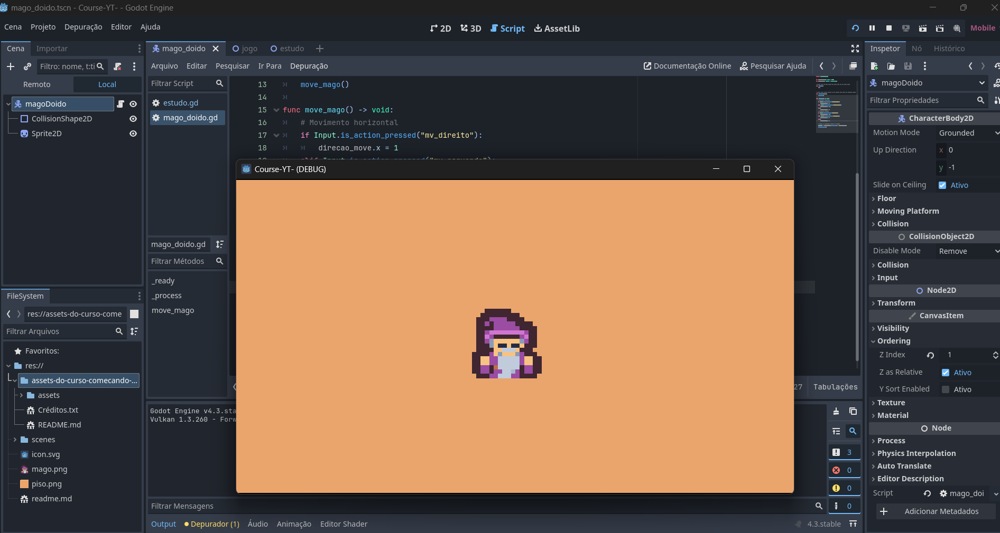

# Estudos de Godot Engine 🎮

Este repositório contém cenas criadas durante meus estudos sobre o **Godot Engine**. O objetivo é explorar e praticar as funcionalidades da engine, como criação de jogos 2D, uso de scripts, manipulação de física e muito mais.

Os estudos foram realizados seguindo o curso gratuito disponível no YouTube no canal **Desenvolvendo Jogos**:

📺 [Curso de Godot Engine no YouTube](https://www.youtube.com/watch?v=S0T2tLV_Ll0&list=PLzjwaizNOg6Q5lLQc-Yf-EIj3WP3eVvCN&index=1)

---

## **Sobre o Curso**
O curso aborda conceitos fundamentais e avançados da Godot Engine, ensinando como criar jogos de forma prática e intuitiva. Entre os tópicos explorados estão:
- Criação de cenas 2D.
- Configuração de objetos, colisões e física.
- Uso de GDScript para lógica de jogos.
- Implementação de mecânicas simples e avançadas.

---

## **Pré-requisitos**
Para visualizar ou modificar os projetos, você precisará instalar o **Godot Engine**.

- 📥 [Baixar Godot Engine](https://godotengine.org/download/windows/)

---

## **Como Usar este Repositório**
1. **Clone o Repositório**:
   ```bash
   git clone https://github.com/Frankl1sales/Course-Start-Godot.git
